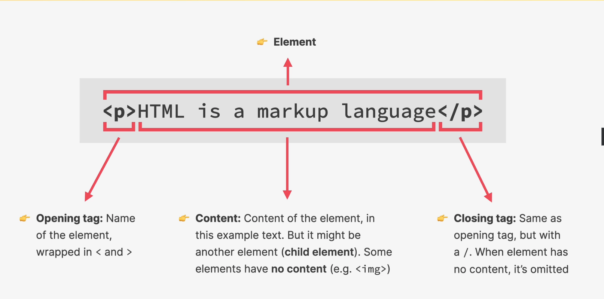
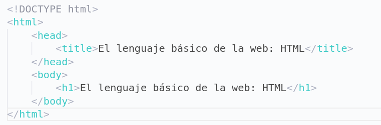

# Curso de HTML y CSS.

Aprenderemos a crear aplicaciones web con html y css.
Este README servirá para tomar apuntes de cada lección.

## Resumen del desarrollo web.

Cuando buscamos una página o navegamos por internet siempre se realiza una petición a un servidor, este servidor según que tipo de página sea la que estés buscando se encargará de darte los archivos HTML, CSS Y JavaScript necesarios para que el navegador te pueda mostrar la página.

Existen dos lados diferentes del desarrollo web, la parte Fron-end y la parte Back-end.

- El Front-end se encarga de la parte visual, la parte del navegador.
- El Back-end es la parte del servidor, la que proporciona y maneja los datos.

En este curso veremos principalmente el Front-end que está conformado por HTML, CSS y JavaScript.

## ¿Qué es HTML?

HTML significa Lenguaje de marcado de Hipertexto.

Este lenguaje se utiliza para describir y estructurar el contenido de una página web. Sus elementos consisten en parrafos, enlaces, titulos, imagenes, videos, etc.

Los navegadores solo entiendo HTML y renderizan código HTML como páginas web.

Anatomía de un elemento HTML.

## Estructura HTML

Su estructura principal se conforma por los elementos **html**, **head** y **body**.

El `<!DOCTYPE html>`se coloca para indicarle al navegador que utilice HTML5.

En el elemento **head** se pone información que le sirve al navegador o motores de busquedad y algunas configuraciones de la página.

En el elemento **body** se escribe todo lo que se va a ver en la página, es la parte que el navegador renderiza.

