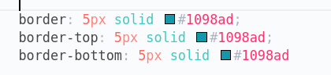

# Curso de HTML y CSS.

Aprenderemos a crear aplicaciones web con html y css.
Este README servirá para tomar apuntes de cada lección.

## Resumen del desarrollo web.

Cuando buscamos una página o navegamos por internet siempre se realiza una petición a un servidor, este servidor según que tipo de página sea la que estés buscando se encargará de darte los archivos HTML, CSS Y JavaScript necesarios para que el navegador te pueda mostrar la página.

Existen dos lados diferentes del desarrollo web, la parte Front-end y la parte Back-end.

- El Front-end se encarga de la parte visual, la parte del navegador.
- El Back-end es la parte del servidor, la que proporciona y maneja los datos.

En este curso veremos principalmente el Front-end que está conformado por HTML, CSS y JavaScript.

## ¿Qué es HTML?

HTML significa Lenguaje de marcado de Hipertexto.

Este lenguaje se utiliza para describir y estructurar el contenido de una página web. Sus elementos consisten en parrafos, enlaces, titulos, imagenes, videos, etc.

Los navegadores solo entienden HTML y renderizan código HTML como páginas web.

Anatomía de un elemento HTML.

## Estructura HTML

Su estructura principal se conforma por los elementos **html**, **head** y **body**.

El `<!DOCTYPE html>`se coloca para indicarle al navegador que utilice HTML5.

En el elemento **head** se pone información que le sirve al navegador o motores de busquedad y algunas configuraciones de la página.

En el elemento **body** se escribe todo lo que se va a ver en la página, es la parte que el navegador renderiza.

## Elementos de tipo texto

Elementos de tipo texto nos permiten agregar contenido como parrafos, títulos, listas, etc:

- `<h1> </h1>`: Sirve para los titulos, teniendo niveles de titulos, `<h1>` sirve para el titulo más importante y hay hasta el `h6`, de más importante a menor.
- `
 
`: Es para el texto simple, parrafos.
- `<strong> </strong>`: Marcar en negrita el contenido con importancia semantica.
- `<em> </em>`: Poner texto en cursiva con importancia semantica.
- `<ul>/<ol>`: Se usa para indicar una lista.
- `<li>`: Item que va dentro de un `<ul>` o `<ol>`.

Nota: Es importante tener el contenido siempre dentro de un elemento html correspondiente, el navegador lo reconocerá y ayudará al SEO.

## Elementos de tipo imagen

Los elementos de tipo imagen se utilizan para mostrar imagenes, mediante sus atributos se configura el path de la imagen, su texto alternativo en caso no cargue la imagen y sus dimensiones.

## Enlaces

Los enlaces sirven para poder anclar sitios web a nuestra web, podemos poner cualquier tipo elemento como un ancla donde hacemos click y nos lleva a la página que le hayamos asignado.

Tipos de anclaje:

- `#` -> Nos a una determinada posición de la página en la que estamos.
- `/archivo.html` -> Nos lleva a un archivo externo.
- `https://www.enlace.com` -> Nos dirige a otra web.

## Elementos de estructura

- `<header> </header>`: Representa la cabecera del contenido.
- `<nav> </nav>`: Indica la barra de navegación.
- `<article> </article>`: Es un articulo.
- `<main> </main>`: Contenido principal de la página.
- `<footer> </footer>`: Pie de página.

## ¿Qué es el HTML Semántico?

Esto engloba las etiquetas HTML que transmiten el significado de su contenido. Ayuda a los buscadores sobre la funcionalidad e importancia de las secciones de tus páginas.

## CSS - ¿Qué es CSS?

Css es un lenguaje de estilos en cascada, es uno de los lenguajes principales del desarrollo web, es la que define el estilo y presentación de la página web.

Css consiste en un monton de propiedades que nos permiten dar formato al contenido html, como el estilo de fuente, colores, posición, espacio, etc.

Anatomía CSS

## En linea, interno y externo CSS.

- En linea: es escribir CSS directamente en elemento.
- Interno: es escribir CSS en el head del documento html, entre las etiquetas `<styles>`
- Externo: Creamos un archivo externo de tipo css y usando la etiqueta `<link>`

## Propiedades de tipo texto.

Propiedades CSS que se les puede aplicar a elemento de tipo texto.

|     Syntax     | Description                      |
| :------------: | -------------------------------- |
|   font-size    | Tamaño de fuente                 |
|  font-family   | Tipo de fuente                   |
| text-transform | Mayúscula/Minúscula              |
|   font-style   | italic/bold/oblique              |
|   text-align   | center/left/right                |
|  line-height   | Separación de texto entre lineas |

## Combinando selectores

Podemos hacer una lista de selectores o anidamiento:

Lista:

Anidamiento:

## Clases y ID

Las clases y id son selectores que nos permiten identificar un elemento html en CSS.

Los ids es un atributo que debe ser único, no puede haber dos ids del mismo nombre en el mismo documento html.

Las clases son normalmente utilizadas para el CSS y pueden ser repetidas, no se usan los ids.

HTML

Clase: `<ul class="related">` - Id: `<ul id="related">`

Selector en CSS

Clase: `.related` - Id: `#related`

Propiedades nuevas:

|   Syntax    | Description                        |
| :---------: | ---------------------------------- |
| font-weight | bold/normal/ligh - Grosor de texto |
| list-style  | Estilo de la lista                 |

## Colores

### RGB

Cada color es representado por una combinacion de <strong style="background-color: red; color: white; padding: 2px">RED</strong>, <strong style="background-color: green; color: white; padding: 2px">GREEN</strong> y <strong style="background-color: blue; color: white; padding: 2px">BLUE</strong>.

### Definición de colores

### Bordes

Propiedad CSS que nos permite agregar bordes a cualquier elemento html.

Nota: Una carácteristica nueva de CSS es que hay propiedades que son 1 de 4, por ejemplo border solo aplica bordes a los 4 lados del elemento.

## PSEUDO-CLASES

Son selectores especiales que nos ayudan a obtener elementos que están en un estado en específico.

### Estilizando enlaces con Psudo-clases

a:

- Link: Estiliza los elementos `<a>` que tengan el atributo href.
- Visited: Aplica estilos a los enlaces ya navegados.
- Hover: Aplica estilos cuando el cursor está encima.
- Active: Aplica estilo al momento de clickear el enlace.

## Chrome DevTool

Es una herramienta del navegador que nos permite visualizar el html y el css de cada elemento, podemos editar, borrar, testear alguna que otra cosa pero no estaremos afectando en nada al código fuente.

## Teoría CSS

### 1 - Conflictos entre selectores.

Si pensamos bien, podemos seleccionar un solo elemento de varias maneras y aplicar distintos estilos, entonces ¿cómo elige CSS que estilos aplicar?

- Por prioridad:

