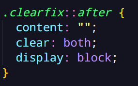
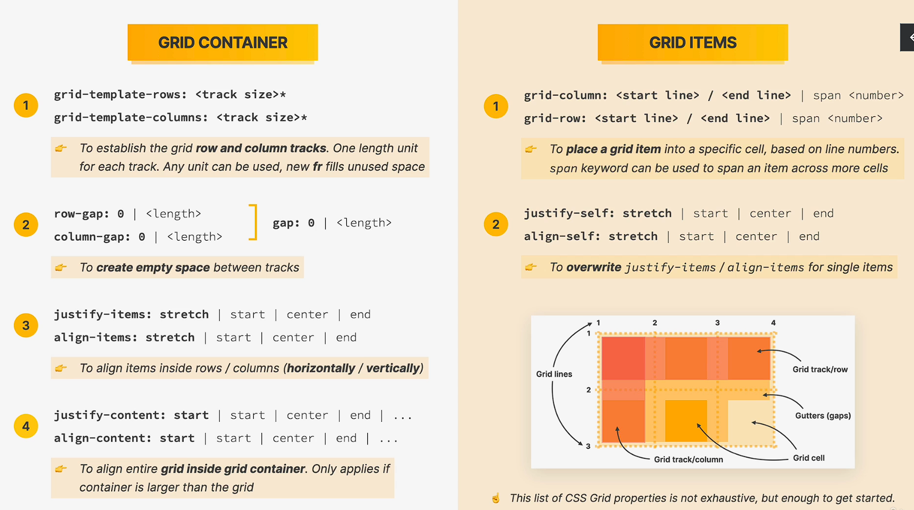

# Curso de HTML y CSS.

Aprenderemos a crear aplicaciones web con html y css.
Este README servirá para tomar apuntes de cada lección.

## Resumen del desarrollo web.

Cuando buscamos una página o navegamos por internet siempre se realiza una petición a un servidor, este servidor según que tipo de página sea la que estés buscando se encargará de darte los archivos HTML, CSS Y JavaScript necesarios para que el navegador te pueda mostrar la página.

Existen dos lados diferentes del desarrollo web, la parte Front-end y la parte Back-end.

- El Front-end se encarga de la parte visual, la parte del navegador.
- El Back-end es la parte del servidor, la que proporciona y maneja los datos.

En este curso veremos principalmente el Front-end que está conformado por HTML, CSS y JavaScript.

# Fundamentos HTML

## ¿Qué es HTML?

HTML significa Lenguaje de marcado de Hipertexto.

Este lenguaje se utiliza para describir y estructurar el contenido de una página web. Sus elementos consisten en parrafos, enlaces, titulos, imagenes, videos, etc.

Los navegadores solo entienden HTML y renderizan código HTML como páginas web.

Anatomía de un elemento HTML.

## Estructura HTML

Su estructura principal se conforma por los elementos **html**, **head** y **body**.

El `<!DOCTYPE html>`se coloca para indicarle al navegador que utilice HTML5.

En el elemento **head** se pone información que le sirve al navegador o motores de busquedad y algunas configuraciones de la página.

En el elemento **body** se escribe todo lo que se va a ver en la página, es la parte que el navegador renderiza.

## Elementos de tipo texto

Elementos de tipo texto nos permiten agregar contenido como parrafos, títulos, listas, etc:

- `<h1> </h1>`: Sirve para los titulos, teniendo niveles de titulos, `<h1>` sirve para el titulo más importante y hay hasta el `h6`, de más importante a menor.
- `
 
`: Es para el texto simple, parrafos.
- `<strong> </strong>`: Marcar en negrita el contenido con importancia semantica.
- `<em> </em>`: Poner texto en cursiva con importancia semantica.
- `<ul>/<ol>`: Se usa para indicar una lista.
- `<li>`: Item que va dentro de un `<ul>` o `<ol>`.

Nota: Es importante tener el contenido siempre dentro de un elemento html correspondiente, el navegador lo reconocerá y ayudará al SEO.

## Elementos de tipo imagen

Los elementos de tipo imagen se utilizan para mostrar imagenes, mediante sus atributos se configura el path de la imagen, su texto alternativo en caso no cargue la imagen y sus dimensiones.

## Enlaces

Los enlaces sirven para poder anclar sitios web a nuestra web, podemos poner cualquier tipo elemento como un ancla donde hacemos click y nos lleva a la página que le hayamos asignado.

Tipos de anclaje:

- `#` -> Nos a una determinada posición de la página en la que estamos.
- `/archivo.html` -> Nos lleva a un archivo externo.
- `https://www.enlace.com` -> Nos dirige a otra web.

## Elementos de estructura

- `<header> </header>`: Representa la cabecera del contenido.
- `<nav> </nav>`: Indica la barra de navegación.
- `<article> </article>`: Es un articulo.
- `<main> </main>`: Contenido principal de la página.
- `<footer> </footer>`: Pie de página.

## ¿Qué es el HTML Semántico?

Esto engloba las etiquetas HTML que transmiten el significado de su contenido. Ayuda a los buscadores sobre la funcionalidad e importancia de las secciones de tus páginas.

# Fundamentos CSS

## CSS - ¿Qué es CSS?

Css es un lenguaje de estilos en cascada, es uno de los lenguajes principales del desarrollo web, es la que define el estilo y presentación de la página web.

Css consiste en un monton de propiedades que nos permiten dar formato al contenido html, como el estilo de fuente, colores, posición, espacio, etc.

Anatomía CSS

## En linea, interno y externo CSS.

- En linea: es escribir CSS directamente en elemento.
- Interno: es escribir CSS en el head del documento html, entre las etiquetas `<styles>`
- Externo: Creamos un archivo externo de tipo css y usando la etiqueta `<link>`

## Propiedades de tipo texto.

Propiedades CSS que se les puede aplicar a elemento de tipo texto.

|     Syntax     | Description                      |
| :------------: | -------------------------------- |
|   font-size    | Tamaño de fuente                 |
|  font-family   | Tipo de fuente                   |
| text-transform | Mayúscula/Minúscula              |
|   font-style   | italic/bold/oblique              |
|   text-align   | center/left/right                |
|  line-height   | Separación de texto entre lineas |

## Combinando selectores

Podemos hacer una lista de selectores o anidamiento:

Lista:

Anidamiento:

## Clases y ID

Las clases y id son selectores que nos permiten identificar un elemento html en CSS.

Los ids es un atributo que debe ser único, no puede haber dos ids del mismo nombre en el mismo documento html.

Las clases son normalmente utilizadas para el CSS y pueden ser repetidas, no se usan los ids.

HTML

Clase: `<ul class="related">` - Id: `<ul id="related">`

Selector en CSS

Clase: `.related` - Id: `#related`

Propiedades nuevas:

|   Syntax    | Description                        |
| :---------: | ---------------------------------- |
| font-weight | bold/normal/ligh - Grosor de texto |
| list-style  | Estilo de la lista                 |

## Colores

### RGB

Cada color es representado por una combinacion de <strong style="background-color: red; color: white; padding: 2px">RED</strong>, <strong style="background-color: green; color: white; padding: 2px">GREEN</strong> y <strong style="background-color: blue; color: white; padding: 2px">BLUE</strong>.

### Definición de colores

### Bordes

Propiedad CSS que nos permite agregar bordes a cualquier elemento html.

Nota: Una carácteristica nueva de CSS es que hay propiedades que son 1 de 4, por ejemplo border solo aplica bordes a los 4 lados del elemento.

## PSEUDO-CLASES

Son selectores especiales que nos ayudan a obtener elementos que están en un estado en específico.

### Estilizando enlaces con Psudo-clases

a:

- Link: Estiliza los elementos `<a>` que tengan el atributo href.
- Visited: Aplica estilos a los enlaces ya navegados.
- Hover: Aplica estilos cuando el cursor está encima.
- Active: Aplica estilo al momento de clickear el enlace.

## Chrome DevTool

Es una herramienta del navegador que nos permite visualizar el html y el css de cada elemento, podemos editar, borrar, testear alguna que otra cosa pero no estaremos afectando en nada al código fuente.

## Teoría CSS

### 1 - Conflictos entre selectores.

Si pensamos bien, podemos seleccionar un solo elemento de varias maneras y aplicar distintos estilos, entonces ¿cómo elige CSS que estilos aplicar?

- Por prioridad:

### 2 - Herencia y Selector universal

Cuando tenemos elementos dentro de otro elemento html podemos aplicar la herencia en estilos, algunas propiedades son heredadas como el `font-size`, `color`, propiedades de tipo texto.

El selector universal es que el selecciona a todos los elementos dentro del body, pero este selector es de muy baja prioridad por ende es fácil de sobreescribir sus estilos.

### 3 - Modelo de caja de CSS

El modelo de caja define como se representan los elementos y su tamaño en la página web.
Esta caja compone de muchas partes:

- Contenido -> El contenido en si, texto, imagenes, etc.
- Relleno (Padding) -> Espacio invisible al rededor del contenido pero que aún está dentro del elemento.
- Margen -> Espacio fuera del elemento en si, que hace una separación con los demás elementos.
- Borde -> Borde que rodea el elemento.
- Area de relleno -> De todo el elemento, que suele ser pintada por un fondo de color o imagen.

El ancho o alto que le apliquemos al elemento no es realmente su verdadero alto y ancho, suman tambien los bordes y el padding.
Pero este es un comportamiento por defecto de CSS y se puede cambiar.

## Usando margenes y paddings

Podemos utilizar la propiedad `padding`para poder utilizar los rellenos en un elemento, también usamos `margin` para pode usar los margenes.

Existe el colapso de margenes, es cuando dos elementos se separan cada quien por su propio margen, entonces uno pensaría que esa separación es una suma de dichos margenes pero no, solo es un margen y suele ser el del mayor margen.

## Añadiendo tamaño - Ancho y Alto

Podemos modificar las dimensiones de los elementos con las propiades de css `width` y `height`.

Trucos: - `margin: 0 auto` -> Para centrar elementos con dimensiones definidas.

## Teoría CSS

### 4 - Tipos de modelo de caja

Existen tres tipos de modelo de caja.

- Inline -> Son elementos que ocupan el espacio necesario para su contenido, no crean saltos de linea. Su problema es que el padding y margin no aplica de manera vertical, solo horizontal así como tampoco le aplican las modificaciones de dimensiones de ancho y alto.

- Bloque -> Los elementos de tipo bloque ocupan todo el espacio que pueden ocupar horizontalmente, creando saltos de linea, apilando a los elementos verticalmente.

- Inline Block -> Son una combinación de lo mejor de los otros dos, se ve como si fuera elemento en linea, ocupa solo lo necesario, no causa saltos en linea pero el modelo de caja es de bloque, podemos usar padding, margin y dimensionar su tamaño como si fuese un modelo de caja de bloque.

### 5 - Posición Absoluta

De forma predeterminada tenemos el flujo de los elementos que va de uno sobre otro, en orden a como está codificado: `position: relative`.

Pero podemos sacar los elementos de ese flujo predeterminado con `position: absolute`, esto hace que dicho elemento no impacte en los demás elementos como si estuviera encima de ellos y para mover el elemento que está fuera del flujo podemos usar las propiedades `top`,`bottom`, `left`, `right`.

Es obligado poner el elemento padre en `position: relative` porque si el elemento no está dentro de un elemento en `position: relative` el elemento en `position: absolute` se moverá según el viewport.

## Pseudo Elementos

Son elementos que no aparecen en `HTML` pero que podemos seleccionar y estilizar en CSS.

A diferencia de las pseudo-clases, estos se seleccionan con `::`

- Selector Adyacente `+`: selecciona el elemento hermano continuo. `h3 + p`

## Debugeando.

A veces existen errores cometidos por nosotros sin darnos cuenta y que debemos arreglar.

En HTML hay unas herramientas que nos pueden ayudar a encontrar los errores que no podamos ver a simple vista.

- [HTML Validator](https://validator.w3.org/) -> Verifica que no haya elementos sin cierre, atributos mal escritos y todo tipo de errores.

- [Diffchecker](https://www.diffchecker.com/) -> Compara el documentos html y nos da las diferencias.

En CSS podemos usar la DevTool del navegador para saber si hemos escrito mal una propiedad o que estilos se aplican y el por qué.

# Diseños: Floats, Flexbox y CSS

## Los 3 caminos para contruir un diseño

¿Qué significa diseño?

El diseño es la forma en como el contenido de nuestra web se colocan y organizan. Esta nos brinda una estructura visual de la pagina.

Existen dos tipos de diseño:

- Diseño de página: Esto es de lo que estabamos hablando sobre la colocación del contenido de alguna forma.

- Diseño de componente: El propio contenido también tiene su diseño, colocación y organización de elementos.

Para construir estos diseños tenemos 3 maneras en CSS:

- Floats: Es la vieja forma de crear diseños usando la propiedades `float` pero está siendo reemplazada rapidamente.

- Flex-box: Es una manera moderna de crear diseños, podemos organizar elementos de forma vertical <strong>o</strong> horizontal sin usar float, perfecto para diseño de componentes.

- CSS Grid: También es un manera moderna en la que puedes organizar los elementos de forma horizontal <strong>y</strong> vertical, perfecto para diseños de página.

## Usando Floats

Cuando usas `float` en un elemento, este es sacado del flujo normal de elementos como si fuese `position: absolute` pero con el `float` se respeta su espacio, quiere decir que los demás elementos se mostrarán al rededor del elemento en `float` pero su modelo de caja de los elementos están detrás del elemento `float`.

Hay algunos problemas con el float, a veces queremos que los hijos de un contenedor lo pongamos en `float` y ocurre el problema de que el contenedor pierde su alto ya que los hijos fueron sacados del flujo.

Un truco para poder solucionar este problema es crear una clase con estas propiedades y ponerlas en el elemento contenedor en cuestión.

## Boxing-sizing: border-box

Con la caja predeterminada de CSS, el ancho o alto total era la suma de su paddings y su contenido.

Con `box-sizing: border-box` cambiamos ese comportamiento, cuando le asignamos el ancho o alto a un elemento, ese elemento tendrá ese tamaño haciendo que el contenido se adapte al tamaño del padding.

## Introducción a Flex-box

Flebox es un método de diseño de página para compaginar elementos en filas o columnas.

Teniendo un contenedor con elementos, podemos darle la propiedad `display: flex` y automaticamente los elementos se pondrán uno al lado de otro, con otras propiedades específicas podemos centrar los elementos:

- `align-items: center`
- `justify-content: center`

Gracias a Flex-Box es mucho más fácil centrar, colocar uno al lado de otro y dividir elementos. Flex-box es el perfecto sustituto de los floats permitiendo escribir codigo más limpio y claro.

### Propiedad - Flex

Flex tiene 3 propiedades importantes que modifican el comportamiento del elemento hijo (flex-item).

- `flex-grow: 0`
- `flex-shrink: 1`
- `flex-basis: auto`

- Flex-basis: Por default es `auto`, con esta propiedad podemos indicar el ancho que tendrá el elemento hijo (flex-item).

- Flex-shrink: Por default es `1`, cuando es `1` indica que el elemento debe respetar el contenedor, o sea que no sobrepasará el ancho del contenedor, en caso sea `0`, los elementos ocuparán el ancho que se les puso con `flex-basis`.

- Flex-grow: Por default es `0`, pero al colocar la propiedad en `1`, los elementos ocuparán todo el espacio que haya en el contenedor, en caso haya un elemento con `grow: 1` y otro elemento con `grow: 2`, entonces el elemento con el `grow` mayor ocupará más espacio del contenedor.

## CSS Grid

Es la formá más moderna de crear layouts de páginas web, es muy completa y sencilla de usar.

Para setear un `grid` se debe colocar el display en `grid` e indicar cuantas columnas o filas queremos que haya en el grid.

Los unicos separadores, creadores de espacio entre los elementos son los `gap`, `column-gap` y `row-gap`.

### Conceptos de CSS Grid

- Es un conjunto de propiedades para contruir diseños bidimensionales.

- La idea detrás de CSS Grid es que podamos dividir un elemento contenedor en filas y columnas rellenandolas con sus elementos hijo.

# Reglas de diseño web

## ¿Por qué es importante un buen diseño web?

Es importante porque crea una buena impresión de la marca o producto, hace que los usuarios confíen, incrementa el valor percibido.

<strong> Todos podemos aprender a diseñar una web. </strong>

Para un buen diseño podemos tener en cuenta lo siguiente:

1. Tipografía
2. Colores
3. Imagenes o ilustraciones
4. Iconos
5. Sombras
6. Bordes de redondeo
7. Espacios en blanco
8. Jerarquia visual
9. Experiencia de usuario.
10. Componentes y Diseño

## Tipografía

La tipografía hace que sea bonito y agradable de leer un texto.

Tips:

- Usa solo tipografías populares e ir a lo seguro.
- Está bien usar solo una tipografía.
- Elegir correctamente la tipografía según la personalidad de la web.
- Limitar tus elecciones, usar una escala de tamaños de fuente.
- Para texto normal no usar menos de 16px y más de 32px.
- Para texto largo usar 20px o más.
- Para titulos podemos usar 50px a más y grosor de 600 a más.
- Para cualquier texto no usar grosor menos de 400.
- Usar menos de 75 carácteres por linea.
- Para texto normal usar separacion de linea entre 1.5 y 2, para texto grande que sea menos de 1.5
- Reducir el espacio entre letras de los titulos.
- Experimentar con capitalizar los titulos pequeños.
- No justificar el texto.
- No centrar un bloque de texto grande.

## Colores

¿Qué colores debemos elegir?

- Utiliza colores que hagan buen match con las personalidad de la web.
- Escoge los tonos adecuados, no escojas coores random.
- Necesitas dos colores en tu paleta, el color principal y el color gris.
- Con max experiencia podemos agregar el color de énfasis.
- Para la variedad, creamos colores mas claros o oscuros de nuestra paleta de colores.

¿Cuándo y dónde debemos usar los colores?

- Usar el color principal para llamar la atención en los elementos importantes de la página.
- Usa los colores para agregar enfasis o hacer que componentes o secciones enteras se destaquen.
- Puedes intentar combinar imagenes y los colores.

Usar colores en las tipografias

- En fondos oscuros podemos intentar usar el mismo color pero de diferente tono (versiona clara) para el texto.
- Usualmente los textos no deberían ser negro puro sino un tipo de gris oscuro.
- No hacer el texto muy claro. (Accesibildad).

## Imagenes e Ilustraciones

- Hay diferentes tipos de imagenes: fotos del producto, fotos storytelling, ilustraciones y patrones.
- Usa imagenes que brinden un mensaje o historia a tu web.
- Preferiblemente imagenes originales.
- Intenta resaltar las emociones de las personas en las imagenes.
- Si la imagen es demasiado grande, si es necesario recorta la imagen.
- Experimenta combinando fotos, ilustraciones y patrones.

Usando texto en las imagenes.

- Oscurecer o aclarar la imagen.
- Colocar el texto en una posición neutral.
- Poner el texto en una caja si es necesario.

## Iconos

- Usa un buen pack de iconos
- Usa solo un paquete iconos, no combines paquetes porque tendrán diferente estilo y se verá inconsistente.
- Usa iconos de formato .svg, podrán escalar y no se verán borrosos.
- Ajusta los iconos a la personalidad de tu web, dependiendo de la tipografía.
- Usa los iconos del mismo color que el texto o de colores para llamar la atención.
- No confundas a tus usuarios poniendo iconos que no tienen algo que ver.

¿Cuando usar los iconos?

- Usa los iconos para asistir visualmente al texto.
- Usa los iconos para las características del producto.
- Usa iconos asociándolos a las acciones.
- Usa iconos como puntos de una lista.

## Sombras

- No es necesario usar sombras todo el tiempo, depende de la personalidad de tu web.
- Usar las sombras en bajas dosis, no lo uses en todos los elementos.
- No usar sombras muy oscuras.

- Usar sombras pequeñas para elementos pequeños en el que debamos llamar la atención.
- Sombras medianas para areas largas que deban llamar un poco mas la atención.
- Sombras grandes para elementos que flotan sobre la interfaz principal de la web.
- Experimenta con las sombras sobre interacciones con el mouse, como click a un botón.
- Puedes experimentas con sombras del color del elemento.

## Border Radius

- Usar `border-radius` hará que tu diseño sea mas divertido.
- Asegúrate que los bordes que apliques conjuguen con los demás elementos.
- Puedes usar `border-radius` en imagenes, botones, iconos, secciones que llamen la atención y otros elementos.

## Espacios en blanco

La correcta cantidad de espacio en blanco hace que el diseño sea mas limpio, moderno y pulido.

- Usa gran cantidad de espacio en blanco entre secciones de tu web.
- Usa mucho espacio en blanco entre grupos de elementos.
- Espacio en blanco entre elementos.
- Dentro de grupo de elementos no uses linea que separen, mejor usa espacios en blanco.
- Los elementos que son un conjunto unidos deben permanecer mas juntos.
- Empieza agregando mucho y después vas reduciendo el espacio.
- Si tiene texto o iconos grandes necesitan mas espacios.
- Intenta usar una regla de espacios, asi podrás elegir limitadamente.

## Jerarquía visual

Se trata de establecer que elementos de nuestro diseño son los mas importantes, los que deben llamar la atención, definiendo un "camino" para los usuarios.

Podemos combinar la posición, el tamaño, los colores, el espacio, bordes y sombras para crear una jerarquía visual entre elementos y componentes.

- Posiciona los elementos mas importantes cerca de la parte superior de la página.
- Las imagenes suelen llamar mucho la atención.
- Los espacios en blanco crean separaciones, úsalos estratégicamente para enfatizar elementos.

Jerarquía en los textos:

- Para texto podemos usar tamaño, grosos, colores y espacios en blanco para indicar importancia.
- Podemos enfatizar elementos como titulos, subtítulos, links, botones, puntos e iconos.

Jerarquía en componentes:

- Enfatiza componentes importantes usando fondos, sombras y bordes.
- Intenta enfatizar el componente A sobre el componente B.
- Podemos enfatizar componentes como Testimoniales, secciones que llaman al acción, cards, formularios, tablas de precios, etc.
